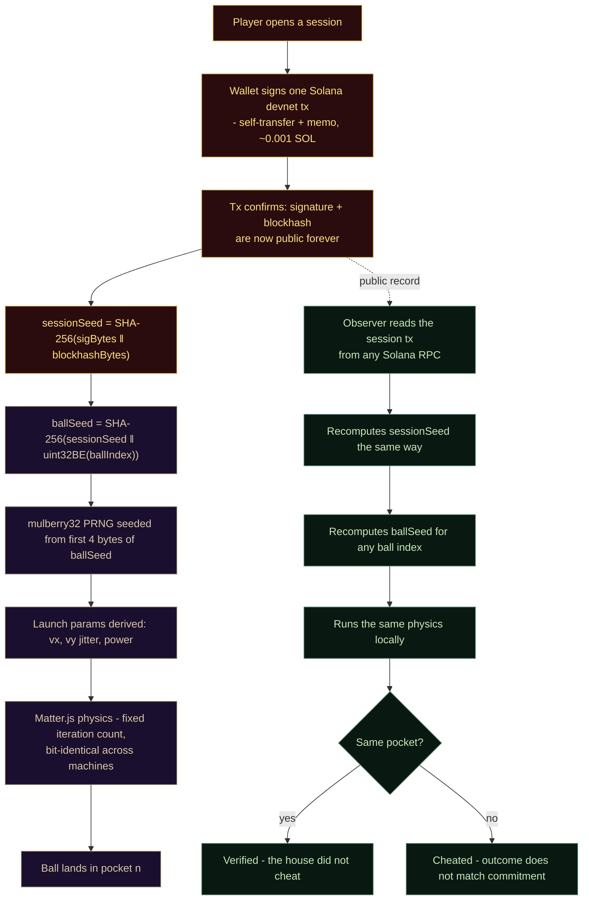

# oatari

A pachinko game where the outcome of every ball can be verified by anyone, from a single public transaction on Solana. No server holds a secret. There is no RNG to trust. The whole thing is one static HTML file.

Play it at [oatari.xyz](https://oatari.xyz), or open `index.html` locally.

The name is 大当たり - the jackpot call you hear on Japanese pachinko floors.

---

## Why this exists

Gambling is the oldest unsolved trust problem in software. Every house is a black box. Every loss *could* have been rigged. Regulators demand audits operators can't actually produce, and players just vote with their feet - pachinko halls in Japan have lost more than half their revenue in two decades, partly for this reason.

"Provably fair" has been the crypto casino answer for a while, and it works: Stake.com alone does tens of billions of dollars a year on that promise. But most implementations are clever commit-reveal schemes bolted onto a slot machine. I wanted to see if the same primitive could drive a real-time physics game - where the outcome is not a hash-modulo but an actual ball bouncing off actual pegs - and still be verifiable in a browser in under a second.

It turns out it can.

---

## How the fairness works

The trick is that physics can be deterministic. If two computers start from the exact same state and step a well-behaved simulation the exact same way, they end up in the exact same place. Every time. So instead of trying to prove a random number is fair, you prove that the *initial conditions* were fair, and let the simulation speak for itself.



Three phases:

**1. Commit (once per session).**  When a player starts a session, the client sends a single Solana memo transaction. The transaction's signature and blockhash - two values that only exist after the network accepts the tx - are hashed together to form the `sessionSeed`. The operator cannot choose them. The player cannot choose them. Once the tx confirms, the seed is frozen on a public ledger.

**2. Play (per ball).**  Each ball's seed is `SHA-256(sessionSeed ‖ uint32BE(ballIndex))`. The first four bytes of that seed seed a mulberry32 PRNG, which produces the launch velocity, jitter, and power. [Matter.js](https://brm.io/matter-js/) runs the physics with a fixed iteration count and a cached engine state, so the trajectory is bit-identical on any browser that speaks IEEE 754 float math.

**3. Verify (anyone, anytime).**  Given the session transaction and a ball index, anyone can recompute the same `sessionSeed`, the same `ballSeed`, the same PRNG stream, and re-run the same simulation. If the pocket they get matches the pocket the house reported, the house did not cheat. If it doesn't, the house cheated - and the proof is a 50-millisecond replay in a browser, not a forensic audit.

The important property is that **there is no VRF, no oracle, and no backend**. The chain's job is to timestamp one seed per session. That's it. Everything else is math any observer can redo from scratch.

---

## Running it locally

```bash
git clone https://github.com/joachimber/pachinko.git
cd pachinko
python3 -m http.server 3004
# open http://localhost:3004
```

That is the entire install. The app is a single `index.html` - no build step, no bundler, no `node_modules`. It talks to Solana devnet directly from the browser via `@solana/web3.js` loaded from a CDN.

You can play as **Guest** (an ephemeral keypair generated in memory, funded from the devnet faucet) or connect **Phantom** if you have it. Either way you're on devnet - no real money is ever involved.

---

## Project layout

```
pachinko/
├── index.html      the whole game - physics, wallet, UI, onchain commits
├── mascot.webm     anime mascot with alpha channel (Chromium/Firefox)
├── mascot.mov      HEVC version with alpha (Safari)
├── CNAME           oatari.xyz GitHub Pages mapping
├── deck/           pitch deck (HTML source + rendered PDF)
└── README.md       you are here
```

Yes, the entire game is one file. I considered splitting it and decided not to - the constraint of "one HTML file, zero backend, deploys to any CDN" ends up being load-bearing for the trust story. Anyone can read the whole thing in an afternoon and satisfy themselves there is no hidden server call.

---

## Verifying a ball yourself

1. Play a session on [oatari.xyz](https://oatari.xyz). Note the session tx signature - the "Session" row in the left panel links to Solana Explorer.
2. Pick a ball index. The app displays each ball's seed as you play.
3. Open the browser devtools console and paste in roughly this:

```js
// given the session tx signature + blockhash (from the explorer)
// and the ball index you want to check
const sig = '...';          // base58 string from explorer
const blockhash = '...';    // base58 string from explorer
const ballIndex = 7;        // for example

const concat = (a, b) => { const c = new Uint8Array(a.length + b.length); c.set(a); c.set(b, a.length); return c; };
const sha = async (u8) => new Uint8Array(await crypto.subtle.digest('SHA-256', u8));
const hex = (u8) => Array.from(u8).map(b => b.toString(16).padStart(2, '0')).join('');

const sessionSeed = await sha(concat(base58Decode(sig), base58Decode(blockhash)));
const idxBytes = new Uint8Array(4); new DataView(idxBytes.buffer).setUint32(0, ballIndex, false);
const ballSeed = await sha(concat(sessionSeed, idxBytes));
console.log('ballSeed', hex(ballSeed));
```

That's the same `ballSeed` the game computed. From there you can re-seed mulberry32, derive the launch params, and run the same Matter.js step loop - whether inside oatari.xyz or in your own page. You should land in the same pocket.

---

## Notes

- Today oatari posts only a *commitment* onchain, not each pocket outcome. The outcome lives in the browser's local session. A production-grade deployment would also commit a hash of the full pocket sequence on session close, so operators couldn't silently re-roll sessions that went badly for them.
- The deterministic physics assumes IEEE 754 compliance and a specific Matter.js version. In practice all mainstream browsers agree. A hostile device could disagree - so the trust model is "anyone with a reasonable browser can verify", not "no device can lie to its own user."
- This is devnet. Mainnet would mean actual compliance work, actual KYC rails, actual boring adult stuff.

---

## Built for

[Superteam Japan](https://japan.superteam.fun/) · Colosseum Frontier Hackathon 2026.

## License

MIT. Take it, fork it, sell fairness to your favorite casino.
